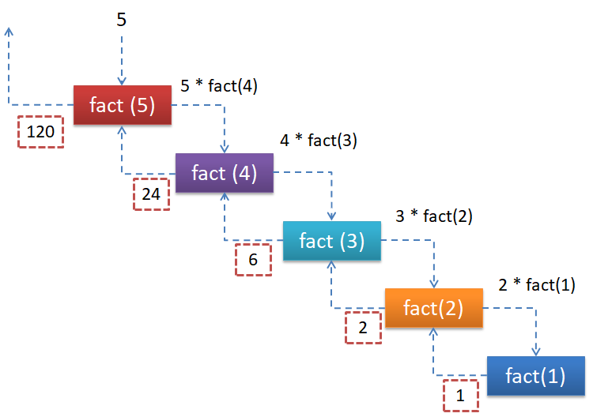
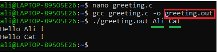

## Objectives :
- Creating and Learning About Functions and Their Types
- Working with Headers
## Functions :
### Introduction :

In previous lectures, we covered many scripts and built various functionalities. However, there are situations where we need to use a functionality multiple times. Copying and pasting the same code repeatedly can make our program unnecessarily large and harder to manage, even for simple tasks. To address this issue, we can use functions. Functions allow us to convert blocks of code into reusable components, making our programs more efficient and organized.
### Create Functions :

To create a function, we need to follow these steps:

- Identify the block of code that we want to turn into reusable code.
- Choose a function name.
- Identify the parameters that the function will need and their types.
- Identify the value that we want the function to return and its type.

After following these steps, we create the function in the functions section. First, we start with the type of the value that the function returns, then the function name, followed by `()` containing the type and name of the parameters the function takes. Finally, we use `{}` to enclose the block of code that the function will execute.
```
float cub(float n){
	return n * n * n;
}
```
Here, we can see that our function has `float` as its return type. This means that after executing the function, it will return a `float` value as the result. The function is named `cub`, followed by `()` containing `float n`. This indicates that the function takes a single argument, which is a float number.  
Inside the `{}`, we see the instruction `return n * n * n;`. This means that the function performs the operation `n * n * n` and then returns the result.  
To use the function, we simply call it by its name, followed by `()` containing the argument we want to pass to the function. If the function returns a result, we can store that result in a variable of the same type as the function's return type.
#### Example :
```
# include <stdio.h>

float cub(float n){
	return n * n * n;
}

int main(){
	float r;
	float n;
	printf("Enter number : ");
	scanf("%f",&n);
	r = cub(n);
	printf("The cub of %f is %f\n",n,r);
	return 0;
}
```
#### Remarque :

- If the function does not take any arguments, we can leave the parentheses `()` empty or specify `void` inside them.
- If the function does not return a value, we use `void` as the return type before the function's name.
- The parametres and return value of a function can be of any type
### Variables Scope :

Let’s suppose we want to create a function that calculates the sum of two numbers, `a` and `b`, as a `float`. The function will take two numbers as arguments, calculate their sum, store the result in a variable called `result`, and then return this variable.
```
# include <stdio.h>

float sum(float a,float b){
	float result = a + b;  
	return result;
}

int main(){
	float r;
	float n1,n2;
	printf("Enter the first number : ");
	scanf("%f",&n1);
	printf("Enter the second number : ");
	scanf("%f",&n2);
	r = sum(n1,n2);
	printf("The sum of %f and %f is %f \n",n1,n2,r);
	return 0;
}
```
What happens if we try to use the variable `result` inside our main function like this?
```
# include <stdio.h>

float sum(float a,float b){
	float result = a + b;  
	return result;
}

int main(){
	float r;
	float n1, n2;
	printf("Enter the first number : ");
	scanf("%f", &n1);
	printf("Enter the second number : ");
	scanf("%f", &n2);
	r = sum(n1, n2);
	printf("The sum of %f and %f is %f \n", n1, n2, r);
	printf("result is &f", result);
	return 0;
}
```
We will encounter an error because the `result` variable is declared _within_ the `sum` function. This means it has **local scope**, and is only accessible _inside_ the function's body.  
Variables declared within a function are not accessible from outside that function. This concept is known as **variable scoping**.
#### Scope :
In programming, **scope** refers to the region of a program where a particular variable or function can be accessed and used.
#### Global scope
Global scope represents the top-level scope of a script file. Any variable or constant created in the function and constant section (outside the `main` function or any other specific function) belongs to this scope. These are referred to as **global variables**.  
Global variables can be accessed and used by any function or block of code within the script.
#### Local scope
Local scope means a variable can only be seen and used inside the function where it is created, if a variable is made inside a function, it’s called a **local variable**. 
In the previous example, the variable ``result`` was created inside the ``sum`` function. This means ``result`` is a local variable and can only be used inside that function.

###  Passing Arguments by Reference in Functions :

When we pass a variable to a function, we're typically working with a **copy** of its value, not the original variable itself, this means that if we modify the value of the variable within the function, the original variable outside the function will remain unchanged.  
To illustrate this, we can create a function designed to swap the values of two variables, 'a' and 'b'.
```
#include <stdio.h>

void swap(int a, int b){
	int tmp = a;
	a = b;
	b = tmp;
}

int main(){
	int a = 5, b = 6;
	printf("Before swap a = %d, b = %d\n",a , b);
	swap(a, b);
	printf("After swap a = %d, b = %d\n", a, b);
	return 0;
}
```
We can see that the change didn't occur. To achieve the desired result, we need to pass these variables by reference. We do this by utilizing a pointer as a parameter within the function. When calling the function, we pass the address of the variables
```
#include <stdio.h>

void swap(int *a, int *b){
	int tmp = *a;
	*a = *b;
	*b = tmp;
}

int main(){
	int a = 5, b = 6;
	printf("Before swap a = %d, b = %d\n", a, b);
	swap(&a, &b);
	printf("After swap a = %d, b = %d\n", a, b);
	return 0;
}
```
### Function with an Arbitrary Number of Parameters :

Some special functions don't have a fixed number of arguments they can take. For example, an improved version of the `sum` function can calculate the sum of 2 numbers, as well as 3, 4, 5 numbers, and so on. To achieve this, we can make the function take an arbitrary number of parameters. This can be done as follows:

- **Include the `stdarg.h` file:** This special file gives us the tools we need to handle variable-length argument list.
- **Create function with 2 paramatre :**:
    - A number telling us how many arguments it will receive.
    - Three dots (`...`) to show that it can take any number of extra arguments after the first number.
- **Declare a pointer using `va_list`:** This data type is specifically designed to point to the variable-length argument list
- **Initialize the pointer using** `va_start(ptr, count)`:
	 - ``ptr`` represent the pointer.
	 - ``count`` represent how many arguments we have.
- **Access arguments using `va_arg(ptr, type)`:** It  retrieves the current argument, advances the pointer to the next argument, and returns the retrieved value. The `type` argument specifies the data type of the expected argument.  
- **After processing all arguments, use `va_end(ptr)`:** This macro cleans up the internal state associated with the `va_list` pointer..

```
#include <stdio.h>
#include <stdarg.h>

int sum(int count, ...){
	va_list ptr;
	va_start(ptr, count);
	int s = 0;
	for(int i = 0; i < count; i++){
	s += va_arg(ptr, int);
	} 
	va_end(ptr);
	return s;
}

int main(){
    int s;
    s = sum(5, 1, 2, 3, 4, 5);
    printf("The sum is %d", s);
	return 0;
}
```
### Recursive Funtions :
Recursive function are special function that have ability to call theirself untill a condition (that we call base state) is valid.  
lets suppose we want to create a function that calculate factorial of numbers  
we know that:

- 0! is equal to 1
- 1! is equal to 1
- 4 is equal to 4\*3\*2\*1
- 5! is equal to 5\*4\*3\*2\*1 = 5\*4!

with that in mind, we can set the base condition as  
if n == 0 we return 1,else we return n multiplied by the factorial of n-1 and so on
```
#include <stdio.h>

int factorial(int n){
	if (n == 0){
		return 1;
	}else{
	return n * factorial(n - 1);
	}
}

int main(){
    int n, r;
    printf("Enter number : ");
    scanf("%d", &n);
    r = factorial(n);
    printf("The factorial of %d is %d", n, r);
	return 0;
}
```

  
#### Remarque
If we are not careful enough with recursive functions, we can end up creating a function that calls itself repeatedly. This can lead to a stack overflow error, causing the program to crash
### Higher-Order Functions :
Higher-order functions are functions that take other functions as arguments. For example, let's say we want to create a calculator. We could create a single function that takes two numbers and an operator as arguments and then performs the calculation. However, this would result in a relatively large and potentially complex function.

We can improve this by creating several smaller sub-functions, each representing a specific operation (e.g., `add`, `subtract`, `multiply`, `divide`). Then, we create a main function that takes two numbers and an operator as arguments. Based on the provided operator, the main function can then call the appropriate sub-function to perform the actual calculation.
```
#include <stdio.h>

float add(float a, float b){
	return a + b;
}
float divide(float a, float b){
	return a / b;
}
float multiply(float a, float b){
	return a * b;
}
float subtract(float a, float b){
	return a - b;
}
float power(float a, float b){
	float p = 1;
	for (int i = 0; i < b; i++){
		p *= a;
	}
	return p;
}
float calculate(float a, float b ,float (* fun)(float a, float b)){
	return fun(a,b);
}

int main(){
	float n1, n2, result;
	char op;
	printf("Enter the first number : ");
	scanf("%f", &n1);
	printf("Enter the second number : ");
	scanf("%f", &n2);
	printf("Enter the operator : ");
	scanf("%s", &op);
	switch(op){
		case '+':
			result = calculate(n1, n2, add);
			break;
		case '-':
			result = calculate(n1, n2, subtract);
			break;
		case '*':
			result = calculate(n1, n2, multiply);
			break;
		case '/':
			result = calculate(n1, n2, divide);
			break;
		case '^':
			result = calculate(n1, n2, power);
			break;
		default:
			printf("Invalid operator");
			return 0;
		break;
	}
	printf("The result of %f %c %f is %f", n1, op, n2, result);
	return 0;
}
```
The `calculate` function takes another function as a parameter. The first two parameters, `float a` and `float b`, are the numbers to perform calculations on. The third parameter is a special parameter that represents a function. It starts with `float` to represent the return value of the function being passed as an argument, followed by `(*fun)`. The name `fun` can be any name, and within the parentheses `()`, we define the types of variables that this function takes
### Customize the Main Function :
So far, we've seen that the main function can have no parameters. In fact, it can take two arguments:
- **`int argc`**: Represents the number of command-line arguments passed to the program.
- **`char *argv[]`**: Represents an array of strings, where each string is a command-line argument.

The first argument (`argv[0]`) typically represents the name of the program itself.
#### Example :
```
#include <stdio.h>

int main(int argc, char *argv[]){
	for(int i = 1; i < argc; i++){
		printf("Hello %s !\n", argv[i]);
	}
	return 0;
}
```
We save this code as `greeting.c`. Then, we compile it. After compilation, we run the program as follows:  

  
The compiled result file is `greeting.out`. We can then run it and provide command-line arguments, such as "Ali" and "Cat". Our program will read these arguments and greet them accordingly.
### Function prototyping :
When working on larger and more complex programs, we often create numerous functions. This can sometimes make it difficult to read the main function, as we may need to scroll through many function definitions to reach it. The main function, often considered the core of the program, should be easily accessible for understanding the overall program flow.  
Function prototyping provides an elegant solution. By declaring function prototypes at the beginning of the file, we simply list the functions we will be using. These prototypes include the function's return type, name, and the data types of its parameters, but not the actual function body.  
After the main function, we then provide the complete function definitions, including their implementations. This approach significantly improves code readability and maintainability by keeping the main function concise and providing a clear overview of the program's structure.
#### Example:
```
#include <stdio.h>

float add(float a, float b);
float divide(float a, float b);
float multiply(float a, float b;
float subtract(float a, float b);
float power(float a, float b);
float calculate(float a, float b ,float (* fun)(float a, float b));
int main(){
	float n1, n2, result;
	char op;
	printf("Enter the first number : ");
	scanf("%f", &n1);
	printf("Enter the second number : ");
	scanf("%f", &n2);
	printf("Enter the operator : ");
	scanf("%s", &op);
	switch(op){
		case '+':
			result = calculate(n1, n2, add);
			break;
		case '-':
			result = calculate(n1, n2, subtract);
			break;
		case '*':
			result = calculate(n1, n2, multiply);
			break;
		case '/':
			result = calculate(n1, n2, divide);
			break;
		case '^':
			result = calculate(n1, n2, power);
			break;
		default:
			printf("Invalid operator");
			return 0;
		break;
	}
	printf("The result of %f %c %f is %f", n1, op, n2, result);
	return 0;
}
float add(float a, float b){
	return a + b;
}
float divide(float a, float b){
	return a / b;
}
float multiply(float a, float b){
	return a * b;
}
float subtract(float a, float b){
	return a - b;
}
float power(float a, float b){
	float p = 1;
	for (int i = 0; i < b; i++){
		p *= a;
	}
	return p;
}
float calculate(float a, float b ,float (* fun)(float a, float b)){
	return fun(a,b);
}

```
### Functional programming :

Functional programming represent the art of solving our problems by dividing the main problem to small sets of sub problems and creating function for each one of them.  
Functional programming cover the following 5 concepts

#### Pure functions :
These functions respect the following :

- They always produce the same output for same arguments irrespective of anything else.
- They have no side-effects i.e. they do not modify any arguments or local/global variables or input/output.
- They have immutability. The pure function's only result is the value it returns. They are deterministic.

#### Recursive function :
Iteration in functional languages is implemented through recursion. Recursive functions repeatedly call themselves until they reache the base case.

#### First-Class functions and Higher-Order function :
First-class functions are dealt with as first-class variable. The first class variables can be passed to functions as parameter, can be returned from functions or stored in data structures. Higher order functions are the functions that take other functions as arguments and they can also return functions.

#### Referential transparency :
In functional programs variables, once defined don't change their value throughout the program. Functional programs do not have assignment statements. If we have to store some value, we define new variables instead. This eliminates any chances of side effects because any variable can be replaced with its actual value at any point of execution. State of any variable is constant at any instant.

#### Variables are Immutable :
In functional programming, we can't modify a variable after it's been initialized. We can create new variables but we can't modify existing variables, and this really helps to maintain state throughout the runtime of a program. Once we create a variable and set its value, we can have full confidence knowing that the value of that variable will never change.

## Headers Files :
### Introduction :
Functions allow us to group blocks of code into reusable units. This means we can call these functions multiple times within the same file without duplicating code. However, when other scripts need to use these functions, copying and pasting them into each script is inefficient and error-prone. To solve this problem, C provides us with **header files**.

Header files are special files used to store function declarations and type definitions, making them accessible across multiple script files. Examples of commonly used header files in C include `stdio.h` and `stdlib.h`.

### Creating a Header File :

1. **Create a New File:** Create a new file with the desired name and the `.h` extension (e.g., `my_header.h`).
2. **Add Include Guards:**
    - At the top, add `#ifndef MY_HEADER_H`
    - On the next line, add `#define MY_HEADER_H`
    - At the end of the file, add `#endif // MY_HEADER_H`
3. **Add Declarations:** Inside the include guards, add:
    - **Function Declarations:** Declare function prototypes (signatures) without their implementations.
    - **Structure Definitions:** Define the structure of data.
    - **Type Definitions:** Create aliases for existing data types.
    - **Macros:** Define macros for code reusability and readability.
    - **Include Other Headers:** Include other necessary header files using `#include`.
4. **Save the File:** Save the file with the `.h` extension.
**Explanation:**
- **Include Guards:**
    - `#ifndef MY_HEADER_H`: This checks if a symbol named `MY_HEADER_H` is not defined. If not, it proceeds.
    - `#define MY_HEADER_H`: This defines the symbol `MY_HEADER_H`.
    - `#endif `: This marks the end of the conditional block.
    - These lines together ensure that the contents of the header file are included only once in a given source file, preventing multiple definitions of the same entities and avoiding 

### Using a Header File in Our Script :

To use the functions or types from a header file in our script, we include the header file using the `#include` keyword. For example:

First, create a header file named `myheader.h`. Inside this file, define the function `sum`.
```
#ifndef my_header
#define my_header
int sum(int a, int b){
	return a + b;
}
#endif
```
Then, we can create a separate script, include `"myheader.h"` in it, and use the `sum` function as needed.
```
#include <stdio.h>
#include "myheader.h"

int main(){
	int a = 4, b = 5, r;
	r = sum(a, b);
	printf("Result of %d + %d is %d", a, b, r);
	return 0;
}
```

## Tasks :
### Task 1 :
Write a recursive function in C that takes a decimal number as input and return it as binary number.
### Task 2 :
Create a header file that contains the following functions: 
- **Function** to find the largest element in an array.
- **Function** to find the smallest element.
- **Function** to calculate the average of all the elements in the array. 
Then, create a program file that prompts the user to enter the number of elements in the array, dynamically allocates memory for the array, and uses the previously defined functions to find and display the largest element, smallest element, and the average of the array elements.
