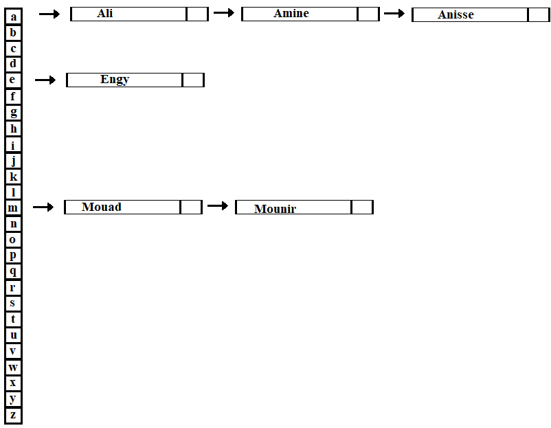
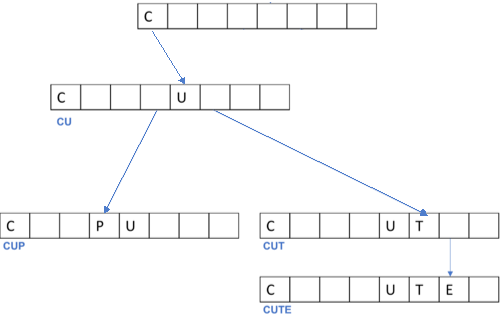
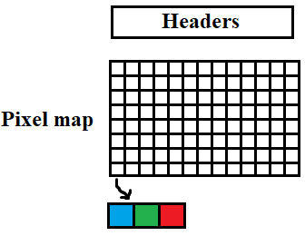
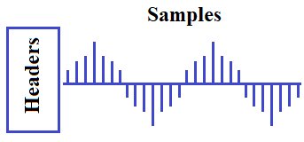

## Objectives :
- Data structures
- Working with Files
- Bitmap and Wave Files
## Data Structures :
When solving problems, we can observe that many problems share common structures and concepts. We can create data types that help us represent these structures effectively.  
These special data types are the tools we use to implement data structures
### Stacks and Queues :
#### Stacks :
The stack is one of the data structures that we can use to solve various problems. The fundamental principle of a stack is that it stores data in an array according to the LIFO (Last-In, First-Out) principle. This means that the last value added to the stack is the first one to be retrieved when reading data from the stack.  
An example of this is a gun's charging system: the last bullet you insert into the magazine will be the first bullet fired.
#### Example :
```
#include <stdio.h>

typedef unsigned bullet;
typedef struct{
unsigned counter;
bullet bullets[20];
}Magazine;

void charge(Magazine *m);
void fire(Magazine *m);

int main(){
	Magazine magazine;
	magazine.counter = 0;
	charge(&magazine);
	charge(&magazine);
	fire(&magazine);
	fire(&magazine);
	return 0;
}

void charge(Magazine *m){
    if(m->counter  > 20){
        printf("Magazine Full!\n");
        return ;
    }
    m->counter = m->counter + 1;
    printf("Charged bullet %i!\n", m->counter);
    m->bullets[m->counter - 1] = m->counter;
    return ;
}

void fire(Magazine *m){
    if (m->counter <= 0){
        printf("Magazine Empty!\n");
        return ;
    }
    printf("Fired  bullet %i!\n", m->counter);
    m->counter = m->counter - 1;
    return ;
}
```
#### Queues :
Queues operate on a different principle than stacks. While stacks follow the LIFO (Last-In, First-Out) principle, queues adhere to the FIFO (First-In, First-Out) principle, meaning the first value added to the queue is the first value to be removed from it.  
An example of this is a job application system where the first 'n' applicants who meet the requirements are typically offered the job
#### Example :

```
#include <stdio.h>

typedef unsigned Worker;
typedef struct{
unsigned counter;
Worker workers[20];
} Application;

void apply(Application *a);
void hire(Application *a);

int main(){
	Application application;
	application.counter = 0;
	apply(&application);
	apply(&application);
	hire(&application);
	hire(&application);
	return 0;
}
void apply(Application *a){
    if(a->counter  > 20){
        printf("Applications are full!\n");
        return ;
    }
    a->counter = a->counter + 1;
    printf("Person %i Applied to the job!\n", a->counter);
    a->workers[a->counter - 1] = a->counter;
    return ;
}

void hire(Application *a){
    if (a->counter <= 0){
        printf("Applications Empty !\n");
        return ;
    }
    printf("Hired Worker %i!\n", a->workers[0]);
    for (int i = 1;i<20;i++){
    a->workers[i-1]=a->workers[i];
    }
    a->counter = a->counter - 1;
    return ;
}
```
### Linked List and Binary Search Trees :
#### Linked List :
Linked Lists are another important data structure and one of the most frequently used ones. We've encountered dynamic arrays, which store data in contiguous blocks of memory. However, what if we don't have sufficient contiguous storage, or if the available storage is scattered in separate blocks? This is where the key power of linked lists lies.

A linked list is a collection of nodes, where each node contains two essential parts:

1. **Data:** The actual value stored within the node.
2. **Pointer (or Link):** A reference to the next node in the sequence.

This structure allows for flexible memory allocation, as nodes can be scattered throughout memory, and the list is maintained by following the chain of pointers from one node to the next  
  
#### Example :
```
#include <stdio.h>
#include <stdlib.h>

typedef struct Node{
    int data;
    struct Node* next;
}Node;

void free_elements(Node* n);

int main(){
	Node Head;
	Node *cursor;
	cursor = &Head;
	int n;
	printf("Enter Number of Elements : ");
	scanf("%d",&n);
	for (int i = 0; i < n; i++){
	    cursor->next = malloc(sizeof(Node));
		printf("Enter element %d : ", i + 1);
		scanf("%d", &cursor->data);
		cursor = cursor->next;
	}
	free(cursor->next);
	cursor->next = NULL;
	cursor = &Head;
	for (int i = 0; i < n; i++){
		printf("Data in element %d  is: %d\n", i + 1, cursor->data);
		cursor = cursor->next;
	}
	free_elements(&Head);
	return 0;
	
}

void free_elements(Node* n){
    if(n->next == NULL){
        free(n);
        return;
    }
    return free_elements(n->next);
    free(n);
}
```
#### Binary Search Trees :
Binary Search Trees (BSTs) are a data structure used to store sorted data elements , the binary search trees is stuctured as folowing
- Each element in the tree is represented as a node.
- Each node contains:
    - A value
    - A left pointer: Points to the node containing a smaller value.
    - A right pointer: Points to the node containing a larger value.
The head of the Binary Search Trees called root node  
  
#### Example :
We will make this Binray Search Tree  
  
```
#include <stdio.h>
#include <stdlib.h>

typedef struct node{
    int number;
    struct node *left;
    struct node *right;
}node;

void free_tree(node *root);
void print_tree(node *root);

int main(void){

    node *tree = NULL;
    node *n = malloc(sizeof(node));
    
    n->number = 2;
    n->left = NULL;
    n->right = NULL;
    tree = n;
    
    n = malloc(sizeof(node));
    n->number = 1;
    n->left = NULL;
    n->right = NULL;
    tree->left = n;
    
    n = malloc(sizeof(node));
    n->number = 3;
    n->left = NULL;
    n->right = NULL;
    tree->right = n;
    
    print_tree(tree);
    free_tree(tree);
    return 0;
}

void free_tree(node *root){
    if (root == NULL){
        return;
    }
    free_tree(root->left);
    free_tree(root->right);
    free(root);
}

void print_tree(node *root){
    if (root == NULL){
        return;
    }
    print_tree(root->left);
    printf("%i\n", root->number);
    print_tree(root->right);
}

```

### Dictionaries, Hash Tables  and Tries :
#### Dictionary :
Dictionaries are data structures that store data in a key-value pair format, much like a real-world dictionary. Each key within a dictionary must be unique, and is associated with a corresponding value. Searching for data in a dictionary is incredibly fast, as you can directly access the value by simply providing its corresponding key. However, storing a large number of unique keys can consume significant memory space. Hashing is a common technique used to efficiently store and retrieve keys in a dictionary by mapping them to specific memory locations, thus improving the performance and memory efficiency of dictionary implementations
#### Hashing and Hash Tables :
Hashing is a technique that transforms an input value into a shorter, fixed-size representation called a hash code. Hash tables utilize this concept by using an array of hash values, where each value can point to a node. Each node typically stores a value and a pointer to the next node (if there are collisions).    
One of the most significant challenges in using hash tables lies in designing an effective hash function. A poorly designed hash function, which maps many different input values to the same hash code, can lead to frequent collisions. This results in longer linked lists at those specific array indices, significantly slowing down the search process. Conversely, an overly complex hash function might produce a large number of unique hash codes, leading to many empty slots in the hash table, which wastes memory space.   
To illustrate this, consider using a hash table to store student names. If we simply use the first letter of each name as the hash code, we would likely encounter many collisions. For example, names starting with 'A' or 'J' might have a large number of entries, while other letters might have very few or none   
  

we can fix this by using first and second letters as hash this will make searching for element faster but we will end up having 24\*24 hash index instead of only 24 and many of them arn't used , that mean we will take more memory then we will use, and here it come to us, we can use simple hash function tat generated small indexes this will result less memory use and more time searching for value or we can use complexe hash map that will result less time in searching for value but more memory use.  
#### Tries :
Tries are another form of data structure designed for efficient string storage and retrieval. One of their key advantages is that they allow searches to be performed in constant time, making them ideal for tasks like autocomplete or prefix matching. However, a downside of Tries is that they tend to consume a large amount of memory, as each node can have multiple children representing different characters, leading to significant memory usage, especially when storing many strings with few shared prefixes.  
  
### Time and Memory complexity :
When solving problems, it's crucial to consider not only the correctness of the solution but also its efficiency. Time and memory complexity are essential concepts for analyzing an algorithm's performance.
#### Example 1:
Calculating the sum of the first 'n' numbers.  
- A simple **for loop** iterates through each number, resulting in O(n) time complexity.  
- Utilizing the formula `sum = n * (n + 1) / 2` allows for constant-time calculation O(1) as it directly computes the sum without iteration.  
**Solution 1:**
```
#include <stdio.h>

int main(){
	float n;
	float sum;
	printf("Enter number : ");
	scanf("%f", &n);
	sum = n * (n + 1) / 2;
	printf("Sum is %f\n", sum);
	return 0;
}
```
**Solution 2:**
```
#include <stdio.h>

int main(){
	int n, sum = 0;
	printf("Enter number : ");
	scanf("%d", &n);
	for(int i = 0; i <= n; i++){
		sum += i;
	}
	printf("Sum is %d\n", sum);
	return 0;
}
```
#### Example 2:
Search algorithms:
- **Linear search** examines each element sequentially, resulting in a time complexity of O(n), where 'n' is the number of elements.
- **Binary search**, applicable to sorted lists, repeatedly divides the search space in half, achieving a significantly faster time complexity of O(log n).
## Working with Files :

### Introductions :

Computers store data in memory while they are running programs and performing calculations. However, this data is temporary. When a program finishes executing, all the variables and results stored in memory are lost.   
To prevent this data loss, we can store it in files. This allows us to retain the information even after the program has completed its execution. 
###  Writing and Appending to Files :

When working with files in C, the first step is to declare a variable of type `FILE` as a pointer. We then use the `fopen("filename", "mode")` function to open or create the file. The first argument of this function is the filename, and the second argument specifies the opening mode.
- **"w" (write):** This mode opens the file for writing. If the file already exists, its contents will be **overwritten**.
- **"a" (append):** This mode opens the file for writing, but **appends** new data to the end of the existing file content.

To write data to a file, we can use the following methods:
- **`fputc(char, fileptr)`:** This function writes a single character to the file buffer.
- **`fwrite(pointer, size, number_of_blocks, fileptr)`:** This function writes a block of data to the file buffer.
    - `pointer`: A pointer to the memory location containing the data to be written.
    - `size`: The size of each data block in bytes.
    - `number_of_blocks`: The number of blocks to be written.
    - `fileptr`: The file pointer.
- **`fprintf(fileptr, format_string, ...)`:** This function writes formatted data to the file buffer. It accepts the file pointer as the first argument and a format string (similar to `printf`) as the second argument, followed by any necessary arguments for the format specifiers.  
Finally, after writing data, it's crucial to close the file using the `fclose(fileptr)` function. This ensures that all data is written to disk properly and releases any system resources associated with the file.
#### Remarque :
**buffer** is a region of memory used to temporarily store data. It acts as a holding place for data that is being transferred from one place to another.
#### Example :
```
#include <stdio.h>

int main(){
	FILE *fptr = fopen("output.txt","w");
	char text[] = "Hello my name is Ali \nnice to meet you All\n";
	fwrite(text,sizeof(char),43,fptr)
	fclose(fptr);
	return 0;
}
```
### Reading Files :
Reading files in C follows a similar process to writing them. First, we declare a variable of type `FILE` as a pointer. We then use the `fopen("filename", "mode")` function to open the file. The first argument is the filename, and the second argument specifies the opening mode. For reading, we use the "r" mode.  
To read data from the file, we can use the following methods:

- **`fgetc(fptr)`:** This function reads a single character from the file and returns it.
- **`fread(pointer, size, number_of_blocks, fptr)`:** This function reads a block of data from the file.
    - `pointer`: A pointer to the memory location where the read data will be stored.
    - `size`: The size of each data block in bytes.
    - `number_of_blocks`: The number of blocks to be read.
    - `fptr`: The file pointer.
- **`fgets(pointer, size, fptr)`:** This function reads a line of text from the file (up to a specified number of characters or a newline character).
    - `pointer`: A pointer to the character array where the read string will be stored.
    - `size`: The maximum number of characters to read, including the null terminator.
    - `fptr`: The file pointer.
Finally, after reading data, it's crucial to close the file using the `fclose(fptr)` function to release any system resources associated with the file.
#### Example :
```
#include <stdio.h>

int main(){
	FILE *fptr = fopen("output.txt","r");
	char c;
	do{
		c = fgetc(fptr);
		printf("%c",c);
	}while(c != EOF);
	fclose(fptr);
	return 0;
}

```
#### Remarque 
In C programming, EOF (End-of-File) is a special integer constant that signifies the end of a file stream

## Bitmap and Wav Files :
### Bitmap Files :
Bitmaps are a common file format for storing images. They leverage the principle that any color can be created by combining varying amounts of red, green, and blue light (RGB).

A bitmap image represents an image as a grid of pixels. Each pixel is typically represented by 24 bits, with 8 bits each for the intensity of red, green, and blue.  
Before the actual pixel data, a bitmap file contains header information. This metadata is structured into two parts:
1. **BITMAPFILEHEADER:** This 14-byte header provides general information about the file, such as the file type (identified by the "BM" signature) and the offset to the pixel data within the file.
2. **BITMAPINFOHEADER:** This 40-byte header contains crucial information about the image itself, including its width, height, color depth, and compression method.
Following these headers, the pixel data is stored as an array of bytes. Each pixel is represented by three consecutive bytes in the order Blue-Green-Red (BGR).
  
#### Example :
In this example, we will see how to grayscale an image. To achieve this, we need to iterate through each pixel in the image and calculate the average of its red, green, and blue color components.
```
#include <stdio.h>
#include <stdint.h>
#include <stdlib.h>

typedef uint8_t  BYTE;
typedef uint32_t DWORD;
typedef int32_t  LONG;
typedef uint16_t WORD;

typedef struct {
WORD bfType;
DWORD bfSize;
WORD bfReserved1;
WORD bfReserved2;
DWORD bfOffBits; } __attribute__((__packed__))
BITMAPFILEHEADER;

typedef struct {
DWORD biSize;
LONG biWidth;
LONG biHeight;
WORD biPlanes;
WORD biBitCount;
DWORD biCompression;
DWORD biSizeImage;
LONG biXPelsPerMeter;
LONG biYPelsPerMeter;
DWORD biClrUsed;
DWORD biClrImportant;  } __attribute__((__packed__))
BITMAPINFOHEADER;

typedef struct{
BYTE B;
BYTE G;
BYTE R;
} __attribute__((__packed__))pixel;

int main(){
    BITMAPINFOHEADER binfo;
    BITMAPFILEHEADER bheader;
    pixel p;
    LONG h = 0, w = 0;
    FILE *fptr = fopen("input.bmp","r");
	FILE *fptr2 = fopen("output.bmp","w");
	fread(&bheader,sizeof(BITMAPFILEHEADER),1,fptr);
	fwrite(&bheader,sizeof(BITMAPFILEHEADER),1,fptr2);
	fread(&binfo,sizeof(BITMAPINFOHEADER),1,fptr);
	fwrite(&binfo,sizeof(BITMAPINFOHEADER),1,fptr2);

	w = abs(binfo.biWidth);
	h = abs(binfo.biHeight);
	WORD gray;
	for(LONG i = 0; i < w; i++){
		for(LONG j = 0; j < h; j++){
			fread(&p,sizeof(pixel),1,fptr);
			gray = (p.G + p.B + p.R) / 3;
			p.G = gray;
			p.R = gray;
			p.B = gray;
			fwrite(&p,sizeof(pixel),1,fptr2);

		}
	}

	fclose(fptr);
	fclose(fptr2);

	return 0;
}

```
#### Remarque :
We use `__attribute__((__packed__))` to tell the compiler to minimize the amount of padding between members of a struct.
### Wav Files :
Another common way to store files is the WAV file format. WAV files are used to store audio data. They begin with a 44-byte "header" that contains metadata about the file, such as the file size, the sampling rate (number of samples per second), and the bit depth (size of each sample, typically 16 bits or 2 bytes).  
After the header, the WAV file contains a sequence of audio samples. Each sample is a single 2-byte (16-bit) integer that represents the amplitude of the audio signal at a specific point in time.  
Scaling the value of each sample by a given factor directly affects the volume of the audio.

- Multiplying each sample value by 2.0 will double the amplitude, effectively increasing the volume.
- Multiplying each sample value by 0.5 will halve the amplitude, effectively decreasing the volume
  
#### Example :
To change the volume of a WAV file, we first need to obtain an integer value representing the factor by which to multiply each sample.   
Next, we need to:

- Read the file header from the input WAV file and copy them to the output WAV file.
- Read the audio samples from the input WAV file.
- Multiply each sample by the volume factor.
- Write the modified samples to the output WAV file
```
#include <stdio.h>
#include <stdint.h>
#include <stdlib.h>

typedef uint16_t WORD;
typedef uint8_t   BYTE;
typedef uint16_t  WORD;
typedef uint32_t  DWORD;


typedef struct
{
    BYTE   chunkID[4];
    DWORD  chunkSize;
    BYTE   format[4];
    BYTE   subchunk1ID[4];
    DWORD  subchunk1Size;
    WORD   audioFormat;
    WORD   numChannels;
    DWORD  sampleRate;
    DWORD  byteRate;
    WORD   blockAlign;
    WORD   bitsPerSample;
    BYTE   subchunk2ID[4];
    DWORD  subchunk2Size;
} __attribute__((__packed__))
WAVHEADER;

int check_format(WAVHEADER header){
    if (header.format[0] == 'W' && header.format[1] == 'A' && header.format[2] == 'V' && header.format[3] == 'E'){
        return 1;
    }
    return 0;
}

int get_block_size(WAVHEADER header){

    return header.bitsPerSample * header.numChannels / 8;
}

int main(int argc, char *argv[])
{
    int size = 0;
    int r = 0, f;
    WAVHEADER header;
    FILE *file = fopen("input.wav", "r");

    if (file == NULL){
        printf("Couldn't open file\n");
        return 1;
    }
    fread(&header, sizeof(WAVHEADER), 1, file);
    if (!check_format(header)){
        printf("Input is not a WAV file.\n");
        fclose(file);
        return 1;
    }
    FILE *output = fopen("output.wav", "w");
    fwrite(&header, sizeof(WAVHEADER), 1, output);
    printf("Enter factor: ");
    scanf("%d", &f);
    size = get_block_size(header);
    uint8_t *buffer = malloc(sizeof(uint8_t) * size);
    int seek = size;
    do
    {
        fread(buffer, size, 1, file);

        for (int i = 0; i < size; i++){
        *(buffer + i) = *(buffer+i) * f;
        }
        fwrite(buffer, size, 1, output);
        if (ftell(file) >= abs(header.subchunk2Size) + 44){
            break;
        }

    }while (1);
    free(buffer);
    fclose(file);
    fclose(output);
    return 0;
}

```
## Tasks :
### Task 1:
Rewrite  the example of queue and stack by replacing fixed size array with linked list.
- **For the first example**: Each time we call the function ``charge`` element (bullet) get appended to the end of the linked list. When the function `fire` is called, the last element of the linked list is removed.
- **For the second example**: Each time someone applies for a job, they are added to the end of the linked list. When we assign a worker, the pointer moves to the second element of the list, making it the new head, and the first element is removed.
### Task 2:
Write a program that converts a bitmap image into ASCII art:
- First, convert the image to grayscale to simplify it into shades of gray.
- Next, write characters to the `output.txt` file based on the gray values as follows:
	- ` ` **225    ->    255**.
	- `.` **200    ->    225**.
	- `:` **175    ->    200**.
	- `-` **150    ->    175**.
	- `=` **125    ->    150**.
	- `+` **100    ->    125**.
	- `*`   **75    ->    100**.
	- `#`   **50    ->     75**.
	- `%`   **25    ->     50**.
	- `@`     **0    ->     25**.
### Hint :
Keep in mind that a bitmap saves pixel data in reversed order. The first row we see when we open the image is actually the last row in the file. Similarly, the top-left pixel in the image corresponds to the bottom-left pixel in the file.
